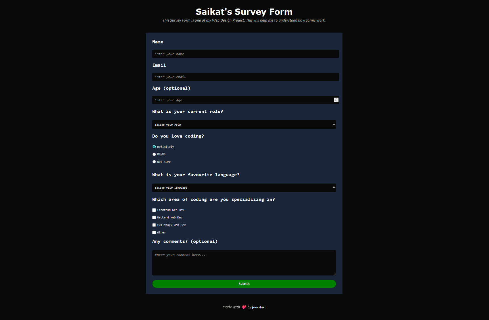

# Responsive Survey Page

A fully responsive and modern survey web page built with **HTML** and **CSS**. This project demonstrates clean layout, interactive form elements, and adaptive design for all devices, making it a great example of practical front-end development.

## Features

- **Responsive Design:** Looks great on mobile, tablet, and desktop screens.
- **Modern CSS Styling:** Utilizes CSS for layout, spacing, colors, and interactive effects.
- **Accessible Form Elements:** Includes text fields, radio buttons, dropdowns, and a comment area.
- **Minimal & Clean UI:** Focuses on user experience and readability.

## Preview

  

## Demo

You can view the live demo at:  
[https://saikat-codes.github.io/survey-page/](https://saikat-codes.github.io/survey-page/)

## Usage

1. **Clone the repository:**

   git clone https://github.com/saikat-codes/survey-page.git

2. **Open `index.html` in your browser.**
3. **Customize** the questions or styling as needed.

## Technologies Used

- **HTML5**
- **CSS3**

## Folder Structure

/project-root
├── index.html
├── style.css
└── README.md

## Customization

- Update survey questions in `index.html`.
- Modify styles in `style.css` to match your branding or preferences.

## Credits

Built by [Saikat Das](https://github.com/saikat-codes).

---

Feel free to use or modify this project for your own surveys or learning purposes!

